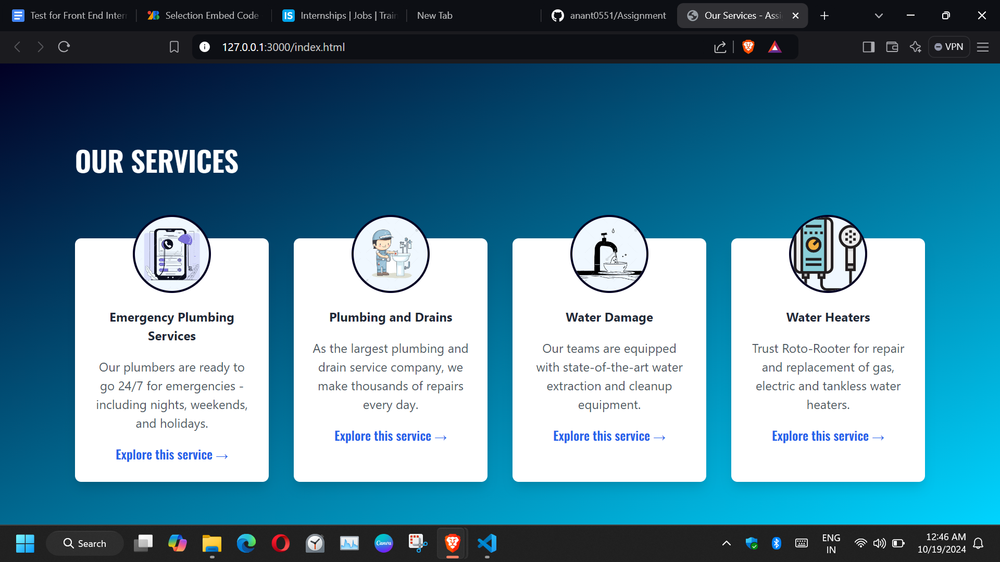

# Our Services - Assignment

This project showcases a simple responsive web page highlighting various plumbing services using HTML, Tailwind CSS, and GSAP for animations.

## Table of Contents

- [Description](#description)
- [Technologies Used](#technologies-used)
- [Features](#features)
- [Installation](#installation)
- [Usage](#usage)
- [Credits](#credits)

## Description

The "Our Services" web page presents a visually appealing layout featuring four service cards, each representing different plumbing services. Each card includes an image, service title, description, and a link to explore the service further. The layout is responsive, adapting to various screen sizes using Tailwind CSS.

## Screenshots




## Technologies Used

- **HTML**: The structure of the webpage.
- **Tailwind CSS**: For styling the layout and components.
- **GSAP (GreenSock Animation Platform)**: For animations and transitions on the service cards.

## Features

- Responsive design that works on mobile and desktop devices.
- Smooth animations for card hover effects and image rotation.
- Clean and modern aesthetic using Tailwind CSS and custom styles.

## Installation

To get started with this project, clone the repository to your local machine:

```bash
git clone https://github.com/yourusername/your-repo-name.git
